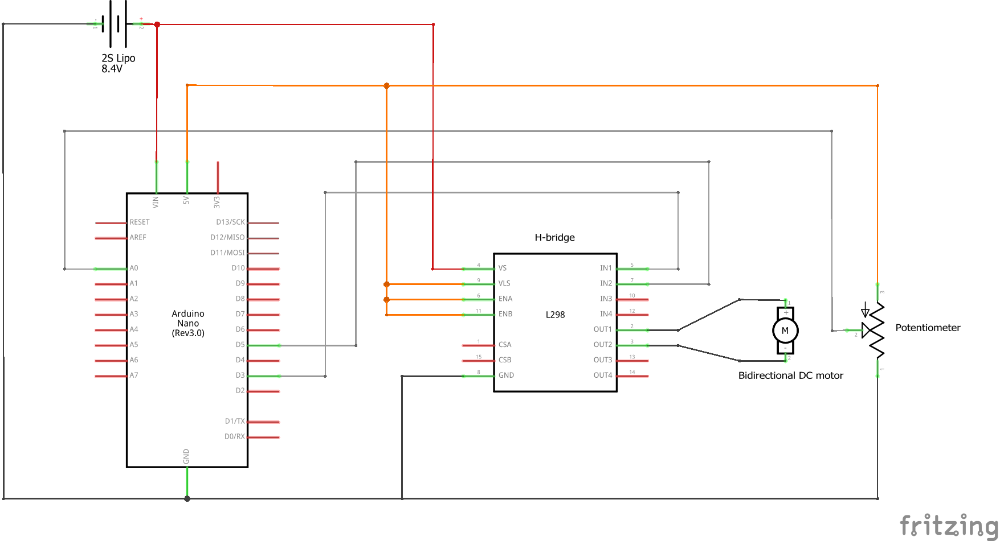

The purpose of this library is to create a custom servo motor. To use it you will need:

- An H-bridge
- A DC motor that can be reversed by flipping the voltage across it.
- An analog sensor that can measure the position of the motor.
		
You will also need a single analog pin and two pins capable of pwm output. See this page 
to find out what pwm pins are available on your arduino board:

https://www.arduino.cc/reference/en/language/functions/analog-io/analogwrite/
	
Each of the components must be connected in the following way:

- The motor leads connect to the H-bridge.
- The H-bridge input pins are connected to the chosen pwm pins of the arduino.
- The sensor is connected to the chosen analog pin of the arduino.

Note that the library uses analogRead() to measure the sensor. As such, the entire range
of motion will be divided to 1024 individual steps. For a 180 degree rotation this means 
a maximum precision of 180/1024 ~ 0.18 degrees.  

The motion of the servo is controlled via a PID loop. The associated coefficients are set 
when a sketch is compiled and cannot be changed once the arduino is running.  

Credit goes to Pavel Holoborodko for the coefficients used to calculate the PID 
derivatives. See this page for his work on noise robust differentiators:

http://www.holoborodko.com/pavel/numerical-methods/numerical-derivative/smooth-low-noise-differentiators/

Finally, the methods of the class are:

- initialize(): sets the input and output pins and calibrates the servo.
- readSensor(): returns the unfiltered sensor signal.
- setPosition(int): sets the target position of the servo.

The schematic below provides an example for the required conections: 

